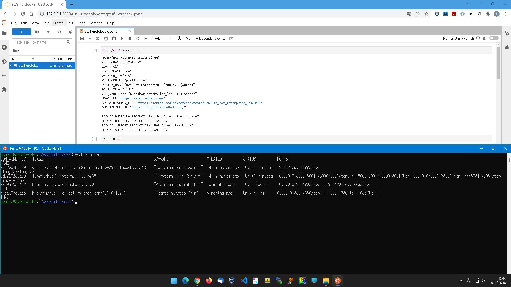

# JupyterHub on Docker

## s2i-minimal-notebook
  - [jupyteronopenshift / s2i-minimal-notebook-py36](https://quay.io/repository/jupyteronopenshift/s2i-minimal-notebook-py36)
  - [thoth-station / s2i-minimal-py38-notebook](https://quay.io/repository/thoth-station/s2i-minimal-py38-notebook)

## Settings
  - Dockerfile.hub
  - jupyterhub_config.py
  - jupyterlab38_cmd.log
  - py38-notebook.ipynb

## Screenshot

