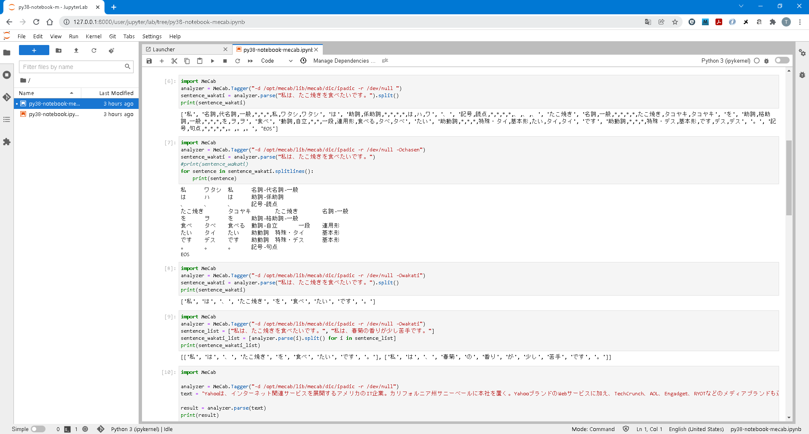

# JupyterHub on Docker

## 利用したコンテナイメージ
  - [jupyteronopenshift / s2i-minimal-notebook-py36](https://quay.io/repository/jupyteronopenshift/s2i-minimal-notebook-py36)
  - [thoth-station / s2i-minimal-py38-notebook](https://quay.io/repository/thoth-station/s2i-minimal-py38-notebook)

## 公開ファイル群

### Dockerfile.hub
  - JupyterHubコンテナイメージのビルド用
  - dockerspawnerやldapauthenticatorのPythonライブラリを追加

### Dockerfile.py38-mecab.lab
  - JupyterLabコンテナイメージのビルド用
  - MeCab本体および操作Client（mecab-python3）のPythonライブラリを追加
  - タイムゾーンをJSTに変更

### cmd.log
  - 作業に用いたコマンドライン
  - コンテナイメージのビルドおよびJupyterHubの起動

### jupyterhub_config.py
  - JupyterHubの環境設定ファイル
  - JupyterHub自体がコンテナ起動する形態を想定

### py38-notebook.ipynb
  - JupyterLabコンテナを使ったみたときのサンプルNotebook

### py38-notebook2.ipynb
  - JupyterLabコンテナを使ったみたときのサンプルNotebook
  - MeCab関連のファイル群にPATHが通っているかを追加でチェック

### py38-notebook-mecab.ipynb
  - JupyterLabコンテナで形態素解析を実行したときのサンプルNotebook
  - dockerspawnerやldapauthenticatorのPythonライブラリを追加

## Screenshot

## JupyterHubから起動した様子

## MeCabで形態素解析をした様子

